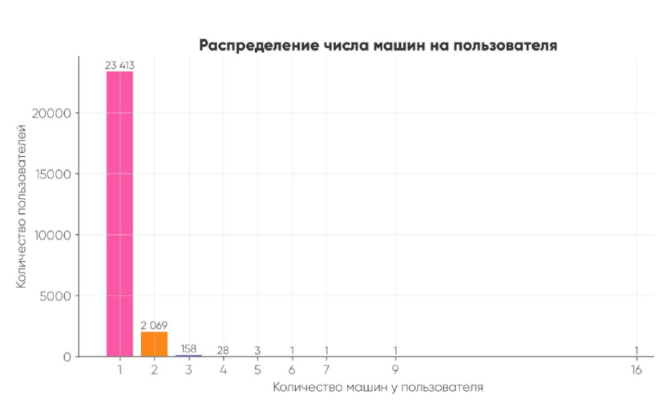
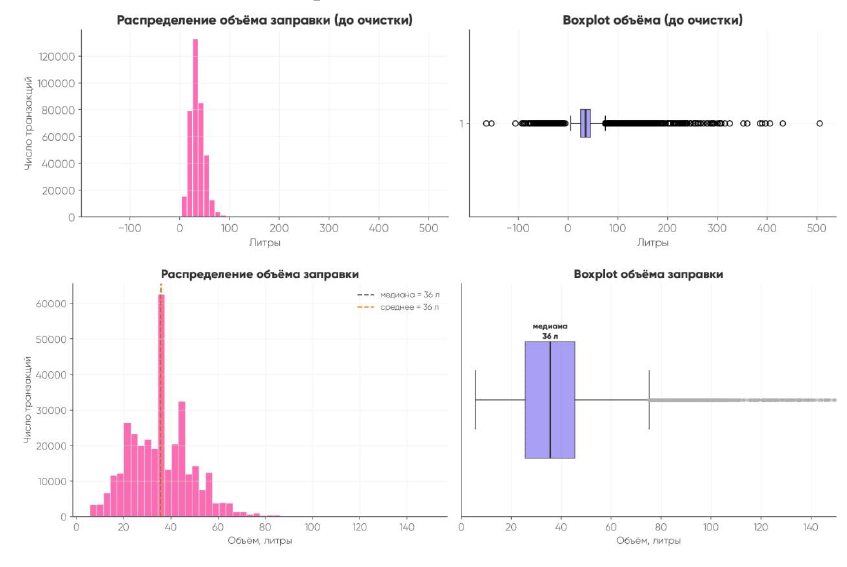
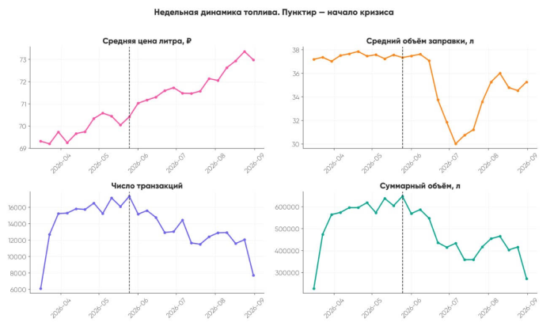
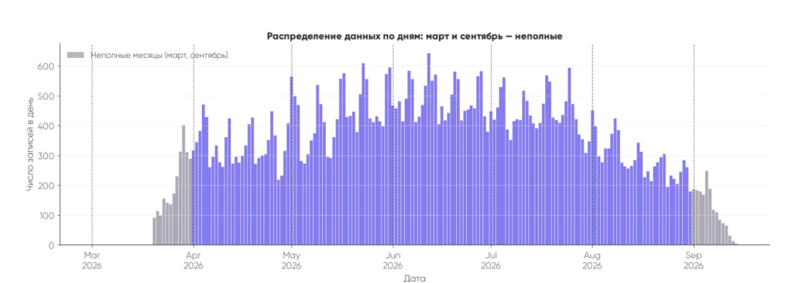
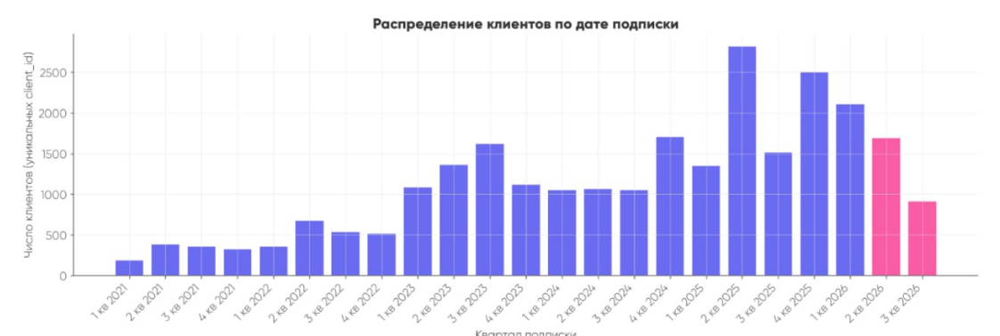

# Топливный кризис

---
## Информация о датасете 

3 таблицы

| Клиенты, авто | Штрафы        | Заправки       |
|--------------|---------------|----------------|
|28237 записей | 77978 записей | 379699 записtq |
|21 признак|7 признаков|5 признаков|

Пропуски есть только в таблице 1, в описательных признаках: color (5,0%), price (2,2%), gender (0,15%). В ключевых для исследования полях пропусков нет. Price и color войдут в модель как контрольные переменные с категорией «не указано»

---

## Преданализ и очистка данных

---

По статистике большинство клиентов имеют только одну машину.
Если ет данных какую именно машину заправлял человек, то мы удаляем, чтобы не ломать дальнейшее исследование

вырезали отрицательное значения литража и выбросы по верхней границе

удаляем неполные месяцы

удаляем тех, кто зарегистрировался после 1го апреля 2026 г

---

Рабочая выборка 

| Клиенты, авто | Штрафы        | Заправки       |
|---------------|---------------|----------------|
| 21068 записей | 56010 записей | 282694 записей |
| 21 признак    | 7 признаков   | 5 признаков    |

Удалили 7169 записей 

---

**ИДЕЯ**: разделить водителей не по количесту штрафов, а по стилю вождения